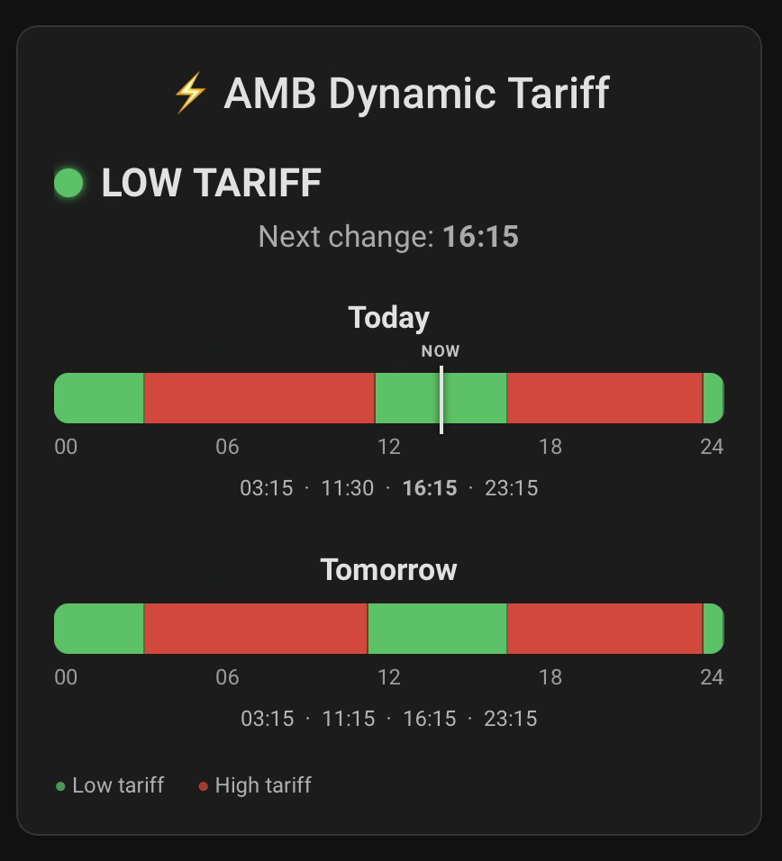

# AMB Dynamic Tariff for Home Assistant

Unofficial Home Assistant custom integration for the public **AMB (Azienda Multiservizi Bellinzona) Dynamic Tariff** schedule.

The integration reads the public AMB tariff chart endpoint and exposes the current rate, next rate change, today's and tomorrow's schedules, and a low-rate binary sensor.

## Installation with HACS

1. Open HACS in Home Assistant.
2. Add this repository as a **Custom repository**.
3. Select category **Integration**.
4. Install **AMB Dynamic Tariff**.
5. Restart Home Assistant.
6. Go to **Settings → Devices & services → Add integration** and search for **AMB Dynamic Tariff**.

No `configuration.yaml` changes are required.

## Entities

- Current rate (`low`, `high`, or `unknown`)
- Next rate
- Next change
- Today's schedule
- Tomorrow's schedule
- Low rate binary sensor
- Last update diagnostic sensor

The schedule sensors expose the complete periods in their `periods` attribute.

## Lovelace tariff timeline card

A graphical Lovelace card can be added to show today's and tomorrow's tariff periods as proportional 24-hour timelines, together with the current rate, the next rate change, and a live **NOW** marker.



### Requirement

Install **Button Card** (`custom-cards/button-card`) from **HACS → Frontend**.

The example below also uses Home Assistant's `sensor.time` entity so that the **NOW** marker is refreshed every minute. If you do not already have `sensor.time`, enable the Home Assistant Time & Date integration.

### Add the card

1. Open the desired Home Assistant dashboard.
2. Select **Edit dashboard**.
3. Select **Add card → Manual**.
4. Paste the following YAML.
5. Save the card.

> **Note:** Home Assistant may generate slightly different entity IDs depending on language and existing entities. The example below uses `sensor.amb_dynamic_tariff_today_s_schedule` and `sensor.amb_dynamic_tariff_tomorrow_s_schedule`. Check **Developer Tools → States** and adjust them if necessary.

```yaml
type: custom:button-card
entity: sensor.amb_dynamic_tariff_current_tariff
show_icon: false
show_name: false
show_state: false

triggers_update:
  - sensor.amb_dynamic_tariff_current_tariff
  - sensor.amb_dynamic_tariff_next_change
  - sensor.amb_dynamic_tariff_today_s_schedule
  - sensor.amb_dynamic_tariff_tomorrow_s_schedule
  - sensor.time

styles:
  card:
    - padding: 20px
    - text-align: left
  grid:
    - grid-template-areas: '"content"'
    - grid-template-columns: 1fr
    - grid-template-rows: auto
  custom_fields:
    content:
      - width: 100%

custom_fields:
  content: |
    [[[
      const todayEntity =
        states['sensor.amb_dynamic_tariff_today_s_schedule'];
      const tomorrowEntity =
        states['sensor.amb_dynamic_tariff_tomorrow_s_schedule'];
      const currentEntity =
        states['sensor.amb_dynamic_tariff_current_tariff'];
      const nextEntity =
        states['sensor.amb_dynamic_tariff_next_change'];

      const current = currentEntity?.state ?? 'unknown';

      const timeToMinutes = (time) => {
        if (time === '00:00') return 0;
        const [h, m] = time.split(':').map(Number);
        return h * 60 + m;
      };

      const makeBar = (periods) => {
        if (!periods || !periods.length) {
          return `<div style="opacity:.6">Schedule unavailable</div>`;
        }

        return `
          <div style="
            display:flex;
            width:100%;
            height:28px;
            overflow:hidden;
            border-radius:8px;
            background:#555;
          ">
            ${periods.map((p, index) => {
              let start = timeToMinutes(p.start_time);
              let end = timeToMinutes(p.end_time);

              if (p.end_time === '00:00' &&
                  index === periods.length - 1) {
                end = 1440;
              }

              const duration = end - start;
              const width = duration / 1440 * 100;
              const color = p.tariff === 'low' ? '#21c45b' : '#e53935';

              return `
                <div
                  title="${p.start_time}–${p.end_time} ${p.tariff}"
                  style="
                    width:${width}%;
                    height:100%;
                    background:${color};
                    border-right:1px solid rgba(0,0,0,.35);
                    box-sizing:border-box;
                  ">
                </div>
              `;
            }).join('')}
          </div>
        `;
      };

      const scale = `
        <div style="
          display:flex;
          justify-content:space-between;
          font-size:12px;
          opacity:.65;
          margin-top:5px;
        ">
          <span>00</span>
          <span>06</span>
          <span>12</span>
          <span>18</span>
          <span>24</span>
        </div>
      `;

      const makeTimes = (periods, highlightTime = null) => {
        if (!periods || !periods.length) return '';

        return `
          <div style="
            display:flex;
            justify-content:center;
            gap:6px;
            flex-wrap:wrap;
            font-size:12px;
            opacity:.78;
            margin-top:8px;
          ">
            ${periods.slice(0,-1).map(p => {
              const highlight = p.end_time === highlightTime;

              return `
                <span style="
                  ${highlight
                    ? `font-weight:700;color:var(--primary-text-color);opacity:1;`
                    : ''}
                ">
                  ${p.end_time}
                </span>
              `;
            }).join('<span>·</span>')}
          </div>
        `;
      };

      const today = todayEntity?.attributes?.periods ?? [];
      const tomorrow = tomorrowEntity?.attributes?.periods ?? [];

      let nextChange = '';

      if (
        nextEntity &&
        !['unknown','unavailable','none'].includes(nextEntity.state)
      ) {
        const d = new Date(nextEntity.state);
        nextChange = d.toLocaleTimeString([], {
          hour: '2-digit',
          minute: '2-digit'
        });
      }

      const statusColor =
        current === 'low'
          ? '#21c45b'
          : current === 'high'
            ? '#e53935'
            : '#888';

      const statusText =
        current === 'low'
          ? 'LOW RATE'
          : current === 'high'
            ? 'HIGH RATE'
            : 'UNKNOWN';

      const now = new Date();
      const nowMinutes = now.getHours() * 60 + now.getMinutes();
      const nowPercent =
        Math.min(100, Math.max(0, nowMinutes / 1440 * 100));

      const todayBar = `
        <div style="position:relative;padding-top:18px;">
          <div style="
            position:absolute;
            left:${nowPercent}%;
            top:0;
            transform:translateX(-50%);
            font-size:9px;
            font-weight:700;
            letter-spacing:.5px;
            opacity:.85;
            white-space:nowrap;
          ">
            NOW
          </div>

          ${makeBar(today)}

          <div style="
            position:absolute;
            left:${nowPercent}%;
            top:14px;
            height:38px;
            width:2px;
            transform:translateX(-1px);
            background:var(--primary-text-color);
            box-shadow:0 0 4px rgba(0,0,0,.8);
            z-index:5;
          "></div>
        </div>
      `;

      return `
        <div style="
          font-family:var(--paper-font-body1_-_font-family);
          color:var(--primary-text-color);
        ">
          <div style="
            font-size:24px;
            font-weight:500;
            margin-bottom:20px;
          ">
            ⚡ AMB Dynamic Tariff
          </div>

          <div style="
            display:flex;
            align-items:center;
            gap:10px;
            margin-bottom:6px;
          ">
            <div style="
              width:16px;
              height:16px;
              border-radius:50%;
              background:${statusColor};
              box-shadow:0 0 5px ${statusColor};
            "></div>

            <div style="font-size:22px;font-weight:700;">
              ${statusText}
            </div>
          </div>

          ${nextChange
            ? `
              <div style="opacity:.72;margin-bottom:24px;">
                Next change:
                <strong style="
                  color:var(--primary-text-color);
                  opacity:1;
                ">
                  ${nextChange}
                </strong>
              </div>
            `
            : ''
          }

          <div style="
            font-size:17px;
            font-weight:600;
            margin-bottom:2px;
          ">
            Today
          </div>

          ${todayBar}
          ${scale}
          ${makeTimes(today, nextChange)}

          <div style="
            font-size:17px;
            font-weight:600;
            margin-top:28px;
            margin-bottom:8px;
          ">
            Tomorrow
          </div>

          ${makeBar(tomorrow)}
          ${scale}
          ${makeTimes(tomorrow)}

          <div style="
            display:flex;
            gap:18px;
            margin-top:22px;
            font-size:12px;
            opacity:.75;
          ">
            <span><span style="color:#21c45b">●</span> Low rate</span>
            <span><span style="color:#e53935">●</span> High rate</span>
          </div>
        </div>
      `;
    ]]]
```

The width of each green/red segment is calculated from the actual AMB tariff period duration, so changes such as 11:15 or 11:30 are positioned proportionally on the 24-hour timeline.

## Data source

Data is retrieved from the public AMB tariff chart endpoint used by the official AMB website. The endpoint currently supplies 15-minute tariff points. AMB chart timestamps are interpreted as Swiss/local tariff wall-clock values to match the official chart.

## Notes

- Refresh interval: 15 minutes.
- Duplicate timestamps are de-duplicated.
- Tariff prices are intentionally not included; this integration only handles the dynamic high/low schedule.
- This project is unofficial and is not affiliated with or endorsed by AMB.

## Changelog

### 0.1.3
- Restored Home Assistant's canonical `strings.json` translation source.
- Fixed entity-name localization while keeping English (GB), English and Italian translations.

### 0.1.2
- Improved Home Assistant localization.
- Added English (GB), English and Italian translations.
- Added localized display states.

### 0.1.1
- Fixed the two-hour shift observed during Swiss summer time.

### 0.1.0
- Initial version.
